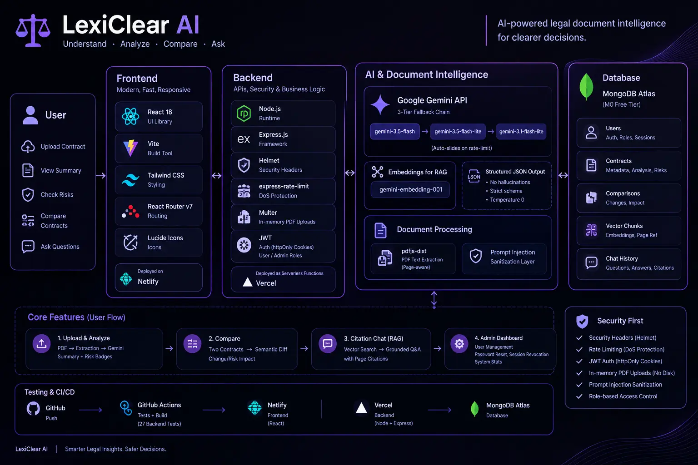

# LexiClear AI

**Vertical:** AI for Legal Assistance & Access

**Persona:** A legal-document intelligence copilot that simplifies contracts, compares versions, and answers questions with citations back to the source text.

**Website URL:** https://lexiclearai.netlify.app/

**Built with:** Developed using **Claude Sonnet** (Anthropic) as the AI coding assistant inside **Antigravity** (Google's agentic IDE), with **Google Gemini** (latest Flash-tier models, via a 3-tier fallback chain) as the in-app AI engine powering document analysis, comparison, and citation-backed Q&A.

LexiClear AI lets anyone upload a contract PDF and get a plain-English executive summary, a clause-by-clause risk breakdown, a side-by-side semantic diff between two contract versions, and an interactive Q&A chat that grounds every answer in a verbatim quote from the document.



---

## 1. Approach & System Architecture

**Zero-hallucination prompting.** Every Gemini call runs at `temperature: 0.0` with `responseMimeType: "application/json"` and a strict `responseSchema`, eliminating conversational filler and guaranteeing parseable output. The system prompt instructs the model to base every claim strictly on the provided text, to mark absent clauses as `NOT_SPECIFIED_IN_DOCUMENT` rather than inferring, and to anchor every clause to a `verbatimQuote` copied exactly from the source.

**Multi-tier model fallback.** `services/geminiService.js` tries a 3-tier model chain (`gemini-3.5-flash` → `gemini-3.5-flash-lite` → `gemini-3.1-flash-lite`) and slides to the next tier only on a 429/quota error — any other error fails fast. The chain is a single exported array; if a model is renamed or deprecated upstream, only that array needs updating.

**In-memory, zero-disk processing.** PDFs are uploaded via `multer.memoryStorage()` and parsed directly from the buffer using `pdfjs-dist` (the actively maintained official PDF.js build — chosen over the abandoned `pdf-parse` package, which bundles a 2019 pdf.js snapshot that fails intermittently on structurally valid PDFs). Nothing is ever written to disk; the buffer is only referenced inside the request handler and is eligible for garbage collection the moment the response is sent.

**Layout-aware parsing & RAG.** Extracted text is split into overlapping chunks tagged with page numbers, embedded with `gemini-embedding-001`, and stored per-document in MongoDB. Chat retrieval ranks chunks by cosine similarity against the question's embedding; if embedding generation fails (e.g. quota exhausted), it degrades gracefully to keyword-overlap ranking rather than hard-failing chat.

**Response caching.** Documents are hashed (SHA-256) on upload; re-analyzing an identical file for the same user returns the cached analysis instantly with 0 Gemini tokens spent.

**Auth.** JWT (httpOnly cookie) with `user` and `admin` roles. A bootstrap admin is created/promoted automatically from `ADMIN_EMAIL`/`ADMIN_PASSWORD` on server start. Admins get a full-management dashboard: view all users and documents, change roles, revoke a user's active sessions (via a `tokenVersion` bump that invalidates outstanding JWTs), and delete accounts.

---

## 2. Security Strategy

| Concern | Mitigation |
|---|---|
| Disk retention | `multer.memoryStorage()` only; buffers never touch disk or persistent storage |
| Spoofed file uploads | MIME-type check *and* PDF magic-byte (`%PDF-`) verification, 10 MB hard limit |
| Prompt injection / jailbreaks | Extracted text is scrubbed of common injection patterns before reaching Gemini; the system prompt also instructs the model to treat document content as untrusted data, not instructions |
| DoS / quota exhaustion | `express-rate-limit` tiers: general API (200/15min), auth (20/15min), AI-backed routes (15/5min) |
| Response headers | `helmet` (CSP, HSTS, X-Frame-Options, etc.) |
| Secrets | `GEMINI_API_KEY` / `MONGO_URI` / `JWT_SECRET` never leave the server process; `.env` is gitignored |
| Auth | JWT in an httpOnly, sameSite cookie; bcrypt-hashed passwords; per-user session revocation |
| Authorization | Every document/chat route is scoped to `req.user`; admin routes require `role: admin` |

## 3. Testing Strategy

27 automated backend tests (Vitest + Supertest), covering:
- **PDF parsing** — valid single/multi-page PDFs, empty buffers, corrupted files, deterministic hashing, text chunking with page-number tracking.
- **Multi-model fallback** — mocked 429s verified to slide through all 3 tiers without throwing, and to fail fast on non-quota errors.
- **Prompt-injection sanitization** — injection patterns stripped, normal legal text left untouched.
- **Health & security headers** — `/health` shape, Helmet headers present, 404 handling.

Frontend resilience: every major view (`Analyze`, `Diff`) is wrapped in a React `ErrorBoundary` with a reset control; network failures on upload/chat surface as dismissible toasts with a retry action, not silent failures.

Run the suite:
```bash
cd server && npm test
```

## 4. Data Flow

```
PDF upload (multer, in-memory)
   → magic-byte + MIME validation
   → pdfjs-dist text extraction (per-page)
   → prompt-injection sanitization
   → Gemini structured analysis (3-tier fallback, temp=0, JSON schema)
   → chunk + embed (gemini-embedding-001) for RAG
   → cached in MongoDB (keyed by SHA-256 of file bytes, scoped to owner)
   → served to client; chat queries retrieve top-K chunks via cosine similarity
     (or keyword fallback) and answer with citations
```

## 5. Local Setup

**Prerequisites:** Node 18+, a MongoDB Atlas M0 cluster, a Gemini API key (Google AI Studio free tier).

```bash
# Backend
cd server
cp .env.example .env   # fill in GEMINI_API_KEY, MONGO_URI, JWT_SECRET, ADMIN_EMAIL, ADMIN_PASSWORD
npm install
npm run dev             # http://localhost:5000

# Frontend (separate terminal)
cd client
npm install
npm run dev              # http://localhost:5173
```

Run backend tests: `cd server && npm test`.

## 6. Deploying (Frontend on Netlify, Backend on Vercel, via GitHub)

Both are separate projects connected to this same GitHub repo, each auto-redeploying on every push to `main`. The backend runs as a Vercel serverless function (`server/api/index.js` + `server/vercel.json`) rather than a long-lived process — see the caveats documented at the top of `server/api/index.js` (per-instance rate limiting, cold starts, function timeout risk on slow Gemini calls).

**Backend → Vercel:**
1. New Project → import this repo → **Root Directory: `server`**
2. Vercel auto-detects `vercel.json`; no build command needed
3. Add every var from `server/.env.example` in Project Settings → Environment Variables (`GEMINI_API_KEY`, `MONGO_URI`, `JWT_SECRET`, `ADMIN_EMAIL`, `ADMIN_PASSWORD`, `CLIENT_ORIGIN` — set this to your Netlify frontend URL once you have it, e.g. `https://lexiclear.netlify.app`)
4. Deploy; note the resulting URL (e.g. `https://lexiclear-api.vercel.app`)

**Frontend → Netlify:**
1. Add new site → Import an existing project → GitHub → this repo
2. **Base directory: `client`** (Netlify picks up `client/netlify.toml` for the build command/publish dir and the SPA redirect rule React Router needs)
3. Add env var `VITE_API_URL` = the backend URL from step 4 above (Site configuration → Environment variables)
4. Deploy; note the resulting URL and go back to update `CLIENT_ORIGIN` on the Vercel backend with it

Deploy the backend first with a placeholder `CLIENT_ORIGIN`, deploy the frontend, then update `CLIENT_ORIGIN` on the backend with the real Netlify URL and redeploy it — this is a one-time chicken-and-egg step since each side needs the other's URL. CORS is locked to a single origin because cookies are sent with `credentials: true`.

## 7. Key Assumptions & Disclaimers

- **Not legal advice.** LexiClear AI provides automated document assistance for informational purposes only. It does not constitute legal advice or binding legal counsel — this disclaimer is shown persistently in the UI. Consult a qualified attorney for decisions with legal consequences.
- Text-only PDFs are supported; scanned/image-only documents with no extractable text are rejected with a clear error rather than silently producing an empty analysis.
- The entire stack runs on free tiers: Google AI Studio (Gemini), MongoDB Atlas M0, and any static/Node host (Vercel/Render) — $0 cost to operate.
